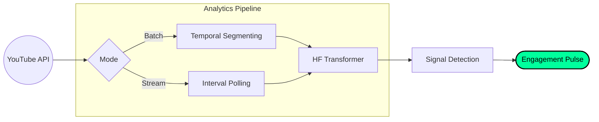

# YouTube Behavioral Analytics Pipeline

A window-based analytics engine designed to detect anomalous engagement patterns and coordinated activity in YouTube comment streams. 

## Overview
Unlike standard sentiment tools, this system implements a dual-phase pipeline to reconstruct historical behavior and monitor live streams. By segmenting data into discrete time windows, the engine identifies statistically significant deviations in user behavior, timing, and sentiment uniformity.

## Core Architecture

### Phase 1: Historical Reconstruction
*   **Full Backfill:** Performs a complete historical fetch of all comments since video publication.
*   **Temporal Segmentation:** Aggregates activity into fixed 10-minute windows for baseline establishment.
*   **Metric Computation:** Calculates behavioral and sentiment-based signals per window.

### Phase 2: Continuous Live Monitoring
*   **Delta Polling:** Polls the [YouTube Data API](https://developers.google.com) at 10-minute intervals for new data.
*   **Stream Processing:** New comments are injected into the same parsing pipeline to update rolling baselines.
*   **Anomaly Detection:** Triggers alerts when incoming data deviates from historical Z-scores.

## Analytics & Metrics
The system stores data in `window_metrics` including:

| Metric | Description |
| :--- | :--- |
| **Coordination Score** | A weighted composite of volume, sentiment, and diversity. |
| **Sentiment Variance** | Measures agreement/divergence (low variance = high uniformity). |
| **Inter-Comment Timing** | Tracks gaps between posts to identify automated consistency. |
| **Author Density** | Ratio of unique authors to total comments to detect concentrated activity. |

## Pattern Detection Engine
The engine is tuned to flag specific engagement signatures:
*   **Concentrated Bursts:** High volume spikes paired with low author growth.
*   **Sentiment Shifts:** Uniform sentiment coupled with sudden, significant shifts in tone.
*   **Clockwork Posting:** Abnormally consistent inter-comment timing suggesting automation.

## Technical Implementation
*   **NLP:** Sentiment computed via [Hugging Face Transformers](https://huggingface.co).
*   **Data Handling:** [Pandas](https://pandas.pydata.org) for window aggregation and rolling statistics.
*   **Statistical Logic:** Normalization via rolling Z-scores to identify outliers.

